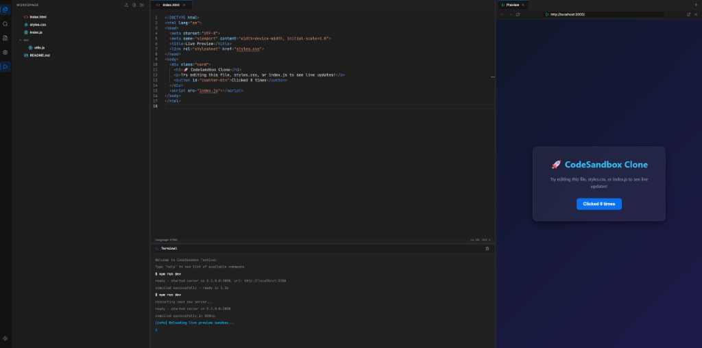

<div align="center">

# 🖥️ CloneIDE — Browser-Based Code Editor

### A feature-rich CodeSandbox / VS Code clone built with Next.js 16, Monaco Editor, and Redux Toolkit



[](https://nextjs.org/)
[](https://react.dev/)
[](https://microsoft.github.io/monaco-editor/)
[](https://redux-toolkit.js.org/)
[](https://www.typescriptlang.org/)
[](https://tailwindcss.com/)

</div>

---

### ⌨️ Keyboard Shortcuts

| Shortcut | Action |
|:---|:---|
| `Ctrl/⌘ + Shift + P` | Command Palette |
| `Ctrl/⌘ + P` | Quick Open File |
| `Ctrl/⌘ + Shift + E` | File Explorer |
| `Ctrl/⌘ + Shift + F` | Search in Files |
| `Ctrl/⌘ + S` | Save & Compile |
| `Ctrl/⌘ + W` | Close Active Tab |

---

## 📦 Installation & Setup

### Prerequisites

- [Node.js](https://nodejs.org/) **v18.x** or newer

### Quick Start

```bash
# 1. Clone the repository
git clone https://github.com/S1ach/CloneIDE.git
cd CloneIDE

# 2. Install dependencies
npm install

# 3. Start the development server
npm run dev
```

Open [http://localhost:3000](http://localhost:3000) in your browser.

### Production Build

```bash
npm run build
npm run start
```

---

## ⚙️ Tech Stack

| Technology | Purpose | Version |
|:---|:---|:---|
| **[Next.js](https://nextjs.org/)** | React SSR framework with App Router | `16.2.7` |
| **[React](https://react.dev/)** | UI library with hooks and Server Components | `19.2.4` |
| **[Monaco Editor](https://microsoft.github.io/monaco-editor/)** | VS Code's code editor engine for the browser | `4.7.0` |
| **[Redux Toolkit](https://redux-toolkit.js.org/)** | Global state management for files, tabs, settings | `2.12.0` |
| **[Tailwind CSS](https://tailwindcss.com/)** | Utility-first CSS with custom design tokens | `v4` |
| **[TypeScript](https://www.typescriptlang.org/)** | Static type-checking across the entire codebase | `5.x` |
| **[Radix UI](https://www.radix-ui.com/)** | Accessible primitives (Context Menu, Dialog, Tooltip, ScrollArea) | `^2.x` |
| **[Lucide React](https://lucide.dev/)** | Beautiful, consistent icon library | `1.17.0` |
| **[react-resizable-panels](https://github.com/bvaughn/react-resizable-panels)** | Resizable panel layout system | `4.11.2` |

---

## 📖 Project Architecture

Built with **[Feature-Sliced Design (FSD)](https://feature-sliced.design/)** methodology:

```
src/
├── app/                          # Application layer
│   ├── globals.css               # Design tokens & global styles
│   ├── layout.tsx                # Root layout with font loading
│   └── providers/                # Redux store provider
│
├── app-pages/                    # Page-level compositions
│   └── ide/                      # Main IDE page assembly
│       └── ui/IDEPage.tsx        # Resizable panel layout orchestrator
│
├── entities/                     # Business domain state
│   ├── editor/                   # Cursor position, language, dirty state
│   ├── explorer/                 # Sidebar active panel tracking
│   ├── file/                     # Virtual file tree (FileNode[])
│   ├── settings/                 # Theme, font size, minimap, preview toggle
│   ├── tab/                      # Opened tabs & active tab management
│   └── terminal/                 # Terminal log entries
│
├── features/                     # User-facing features
│   └── command-palette/          # Fuzzy search & command palette modal
│
├── shared/                       # Shared infrastructure
│   ├── hooks/                    # useKeyboardShortcut, usePlatform
│   ├── lib/                      # Utility functions (cn)
│   └── ui/                       # Reusable primitives (ScrollArea)
│
└── widgets/                      # Composite UI blocks
    ├── activity-bar/             # Left icon bar (Explorer, Search, Settings)
    ├── browser-tab/              # Browser tab bar primitives
    ├── editor-layout/            # Monaco editor + tab bar + status bar
    ├── preview-panel/            # Live preview iframe + browser chrome
    ├── sidebar/                  # FileExplorer, SearchPanel, SettingsPanel
    └── terminal-panel/           # Interactive terminal emulator
```

---

## 🛠️ Available Scripts

| Command | Description |
|:---|:---|
| `npm run dev` | Start development server |
| `npm run build` | Create optimized production build |
| `npm run start` | Run the production server |
| `npm run lint` | Run ESLint |

